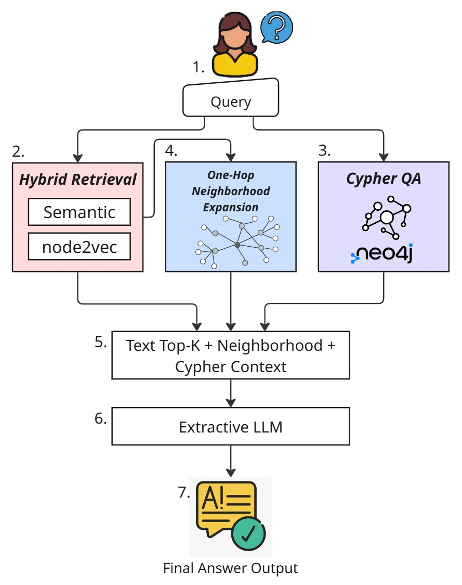

# 🧠 Mini KG-RAG Application using OWL Knowledge Graph

## 🔍 Overview
This project demonstrates how to implement a Retrieval-Augmented Generation (RAG) pipeline using only structured data from a Knowledge Graph in OWL format. It uses:

- Neo4j with RDF plugins to store and query the ontology.
- Cypher queries to extract triples.
- Large Language Models (LLMs) to generate answers based on the retrieved context.
- LangChain to orchestrate the entire pipeline.
- Gradio for the user interface (in future).
- The project is designed to be modular and extensible, allowing for easy integration of new components or modifications to existing ones.

## 🏛️ Architecture
The RAG pipeline consists of the following key components:



## Components
- **KG**: The Knowledge Graph in OWL format, which contains the structured data.
- **Neo4j**: The graph database used to store and query the KG.
- **Cypher Queries**: Used to extract triples from the KG.
- **LLMs**: Large Language Models used to generate answers based on the retrieved context.
- **LangChain**: A framework for building applications with LLMs, used to orchestrate the entire pipeline.
- **Gradio**: A library for building user interfaces, used to create a simple web interface for the application.
- **Docker**: Used to containerize the application for easy deployment and scalability.

## 🛠️ Requirements

Create a virtual environment Ubuntu and activate it:

```bash
conda create -n miniKGraphRAG python=3.11 -y
conda activate miniKGraphRAG
```

Install the dependencies with:

```bash
pip install -r requirements.txt
```
## 🗄️ Database Setup

### Neo4j

You can use the provided `docker-compose.yml` file to start a Neo4j container easily. Make sure Docker is installed on your system.

1. Copy the example `docker-compose.yml` file to your project directory.
2. Start the Neo4j container with:

```bash
docker-compose up -d
```

3. Access Neo4j at [http://localhost:7474](http://localhost:7474) with the default username and password (`neo4j` / `neo4j`). Change the password on first login.

Make sure to enable the RDF plugin if required for your use case.


## 🚀 How to Run
1. Make sure you have the following services running:
    - **Neo4j**: Make sure you have the Neo4j database running with the RDF plugin enabled. You can use Docker to run Neo4j using the imagen `neo4j:community`.
    - **Ollama**: Make sure you have the Ollama server running. You can install it from [Ollama's website](https://ollama.com/).
    - **API KEY**: Make sure you have the API key OpenAI

If you are going to use Ollama, in a WSL terminal run the following command to start the Ollama server:

```bash
ollama serve
```

2. When the server is running, open a new terminal and run the following command to run the model:
You should see a message indicating that the model is ready to accept requests.

```bash
ollama run deepseek-r1:1.5b
```

3. Verify that the model is running by checking the output in the terminal. 

```bash
curl http://localhost:11434

```

4. Make sure you have the OWL file in the `data` directory. The OWL file should be named `your_owl_file.owl`. You can replace it with your own OWL file.
5. Update the `main.py` file with your Neo4j connection details and the path to your OWL file.

6. Run the script:

```bash
python hybrid_rag_kg.py
```
You can obtain something like this:

```bash
✅ Successfully connection to Neo4j Graph Database
✅ Node2Vec loaded: 2069 (2069, 512)
✅ Embeddings Node2Vec cargados: (2069, 512)
✅ Modelo de texto cargado. Dimensión de embeddings: 512
✅ Successfully load LLM
✅ Successfully connection to Neo4j Graph
✅ Successfully build Cypher QA chain
🔍 Running Hybrid RAG...
📝 Semantic + Node2Vec fusion over node texts

❓ Em que bacia está localizado o campo JAPIIM?

> Entering new GraphCypherQAChain chain...
Generated Cypher:
MATCH (f:field)-[:located_in]->(b:basin)
WHERE "JAPIIM" IN f.rdfs_label
RETURN b.rdfs_label
Full Context:
[{'b.rdfs_label': ['BACIA DE AMAZONAS', 'AMAZONAS']}]

> Finished chain.

✅ Pregunta: Em que bacia está localizado o campo JAPIIM?

✅ Respuesta gerada: 
O campo MORRO DO BARRO está localizado na Bacia AMAZONAS.

```

## 🧩 Configuration

Configure the main_neo4j.py file with the parameters for the Neo4j connection.

```bash
graph = Neo4jGraph(
    url="bolt://localhost:7687",
    username="neo4j",
    password="tu_contraseña"
)
```

## Troubleshooting

- ModuleNotFoundError: openai: instala el paquete openai aunque no uses la API.
- ImportError GraphCypherQAChain: asegúrate de importar todo desde langchain_neo4j.
- ValidationError for GraphCypherQAChain: usa la misma fuente (langchain_neo4j) para el Neo4jGraph y el Chain.
